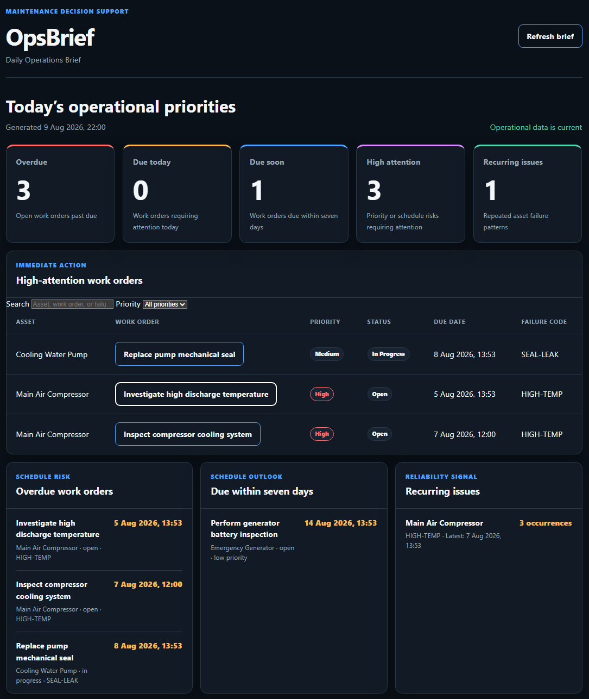

# OpsBrief

[](https://github.com/mhmd0x/OpsBrief/actions/workflows/tests.yml)

OpsBrief is a maintenance decision-support API that turns asset and work-order data into operational briefs, risk signals, and recurring-issue insights.



[Read the full OpsBrief case study](docs/CASE_STUDY.md)

## Problem

Maintenance supervisors often depend on fragmented information from CMMS records, spreadsheets, emails, messages, and shift handovers.

OpsBrief is being developed to surface what requires attention instead of only displaying raw maintenance data.

## Current Features

- Complete asset CRUD API
- Complete work-order CRUD API
- PostgreSQL persistence with SQLAlchemy
- Alembic database migrations
- Docker Compose development environment
- Unique asset-tag enforcement
- Asset-to-work-order data-integrity protection
- Overdue work-order detection
- Due-today detection using the Asia/Riyadh timezone
- High-attention work-order detection
- Recurring failure detection by asset and failure code
- Preventive, corrective, predictive, and inspection work-order classification
- Automatic work-order completion timestamps
- Monthly PM compliance and schedule-performance insight
- Calendar-day recovery pace required to reach 100% monthly PM completion
- Daily Operations Brief API
- Isolated automated database tests
- API-key protection for create, update, and delete operations
- Reusable realistic maintenance demo-data seeder
- Responsive Daily Operations Brief dashboard
- Seven-day upcoming work-order risk detection
- Asset-aware work-order context throughout the dashboard
- Dashboard search and priority filtering
- Interactive work-order detail dialog
- Interactive recurring-issue reliability details
- Interactive planned, completed, remaining, and overdue PM drill-downs

## API Endpoints

| Method | Endpoint | Description |
|---|---|---|
| `GET` | `/` | Open the Daily Operations Brief dashboard |
| `GET` | `/health` | Check API health |
| `POST` | `/assets` | Create an asset |
| `GET` | `/assets` | List assets |
| `GET` | `/assets/{asset_id}` | Retrieve an asset |
| `PATCH` | `/assets/{asset_id}` | Update an asset |
| `DELETE` | `/assets/{asset_id}` | Delete an asset |
| `POST` | `/work-orders` | Create a work order |
| `GET` | `/work-orders` | List work orders |
| `GET` | `/work-orders/overdue` | List overdue work orders |
| `GET` | `/work-orders/due-today` | List work orders due today |
| `GET` | `/work-orders/due-soon` | List work orders due within seven days |
| `GET` | `/work-orders/high-attention` | List high-attention work orders |
| `GET` | `/work-orders/{work_order_id}` | Retrieve a work order |
| `PATCH` | `/work-orders/{work_order_id}` | Update a work order |
| `DELETE` | `/work-orders/{work_order_id}` | Delete a work order |
| `GET` | `/insights/recurring-issues` | Detect recurring asset failures |
| `GET` | `/insights/monthly-pm-compliance` | Measure monthly PM completion, plan status, and required daily pace |
| `GET` | `/briefs/daily` | Generate the Daily Operations Brief |

Interactive API documentation is available at `/docs` while the application is running.

## API Authorization

Read-only `GET` endpoints are publicly accessible.

Creating, updating, or deleting data requires an API key in the `X-API-Key` request header.

Create a private key in your local `.env` file:

```dotenv
OPSBRIEF_API_KEY=your-secure-random-value
```

Generate a suitable key with:

```bash
python -c "import secrets; print(secrets.token_urlsafe(32))"
```

When using `/docs`, click **Authorize** and enter the key. Never commit the real key to Git or include it in screenshots.

Example request:

```bash
curl -X POST http://127.0.0.1:8000/assets \
  -H "Content-Type: application/json" \
  -H "X-API-Key: your-secure-random-value" \
  -d '{
    "name": "Main Air Compressor",
    "asset_tag": "COMP-001",
    "location": "Utilities Area"
  }'
```

## Technology

- Python
- FastAPI
- PostgreSQL
- SQLAlchemy
- Alembic
- Pydantic
- Pytest
- Docker Compose

## Requirements

- Python 3.11 or newer
- Docker with Docker Compose
- Git

## Running the Full Stack with Docker

Create the local environment file:

```bash
cp .env.example .env
```

The example file contains development-only database credentials. Before using
OpsBrief in a shared or production environment, replace `POSTGRES_PASSWORD`
with a unique secret and replace `OPSBRIEF_API_KEY` with a generated private
key. Docker Compose requires `POSTGRES_PASSWORD` to be supplied explicitly;
there is no built-in password fallback. Because Compose embeds the password in
`DATABASE_URL`, use a URL-safe password containing only letters, numbers,
`-`, `_`, `.`, or `~`. Generate one with:

```bash
python -c "import secrets; print(secrets.token_urlsafe(32))"
```

`APP_ENV` selects the runtime environment:

- `local`: uses `DATABASE_URL` when provided, otherwise falls back to the local SQLite database.
- `test`: uses `DATABASE_URL` when provided, otherwise permits the SQLite fallback used by tests.
- `production`: requires `DATABASE_URL` and rejects SQLite URLs during startup.

Production deployments must set both `APP_ENV=production` and a non-SQLite
`DATABASE_URL`. The application fails before serving requests if either
production database requirement is invalid. Error messages do not include the
database URL or credentials.

Build and start the API and PostgreSQL:

```bash
docker compose up --build -d
```

Check both services:

```bash
docker compose ps
```

Both the `api` and `database` services should report `healthy`.

Open the Daily Operations Brief dashboard at:

```text
http://127.0.0.1:8000/
```

Open the API documentation at:

```text
http://127.0.0.1:8000/docs
```

Stop the services without deleting database data:

```bash
docker compose down
```

## Development Setup

Clone the repository and enter its directory:

```bash
git clone https://github.com/mhmd0x/OpsBrief.git
cd OpsBrief
```

Create a virtual environment:

```bash
python -m venv .venv
```

Activate it on Linux or macOS:

```bash
source .venv/bin/activate
```

Activate it on Windows PowerShell:

```powershell
.venv\Scripts\Activate.ps1
```

Install the project and development dependencies:

```bash
python -m pip install -e ".[dev]"
```

Create the local environment file:

```bash
cp .env.example .env
```

On Windows PowerShell, use:

```powershell
Copy-Item .env.example .env
```

For host-based development, make PostgreSQL available at `localhost:5432`.
The PostgreSQL service in Docker Compose is intentionally internal-only; use
the full-stack Docker instructions above when you want the API and database to
run entirely in containers.

Apply the database migrations:

```bash
python -m alembic upgrade head
```

Load optional realistic maintenance demo data:

```bash
python -m app.seed
```

The seeder only adds records when the database contains no work orders, preventing accidental duplicate demo data.

Start the API:

```bash
python -m uvicorn app.main:app --reload
```

Open the Daily Operations Brief dashboard at:

```text
http://127.0.0.1:8000/
```

Open the interactive documentation at:

```text
http://127.0.0.1:8000/docs
```

## Running Tests

Run the complete test suite:

```bash
python -m pytest
```

The tests use a separate in-memory SQLite database and do not modify development data stored in PostgreSQL.

## Stopping the Development Database

For the containerized development environment, stop the PostgreSQL container:

```bash
docker compose down
```

Avoid using `docker compose down -v` unless you intentionally want to delete the local PostgreSQL data.

For host-based development, stop PostgreSQL using the service manager for the
PostgreSQL installation you provided at `localhost:5432`.

## Project Structure

```text
OpsBrief/
├── .github/
│   └── workflows/
│       └── tests.yml
├── alembic/
│   └── versions/
├── docs/
│   ├── images/
│   │   ├── opsbrief-dashboard.png
│   │   ├── opsbrief-pm-work-orders.png
│   │   ├── opsbrief-recurring-issue-details.png
│   │   └── opsbrief-work-order-details.png
│   └── CASE_STUDY.md
├── app/
│   ├── routers/
│   │   ├── __init__.py
│   │   ├── assets.py
│   │   ├── briefs.py
│   │   ├── insights.py
│   │   └── work_orders.py
│   ├── static/
│   │   ├── dashboard.js
│   │   ├── index.html
│   │   └── styles.css
│   ├── __init__.py
│   ├── config.py
│   ├── database.py
│   ├── main.py
│   ├── models.py
│   ├── schemas.py
│   ├── security.py
│   └── seed.py
├── tests/
│   ├── conftest.py
│   ├── test_assets.py
│   ├── test_dashboard.py
│   ├── test_due_soon.py
│   ├── test_health.py
│   ├── test_pm_compliance.py
│   ├── test_security.py
│   └── test_work_orders.py
├── .dockerignore
├── .env.example
├── .gitignore
├── alembic.ini
├── compose.yaml
├── Dockerfile
├── LICENSE
├── pyproject.toml
└── README.md
```

## Planned Development

The next milestones are:

- Additional operational risk signals
- Role-based user authentication
- Production deployment and monitoring

## Status

Active early-stage development.