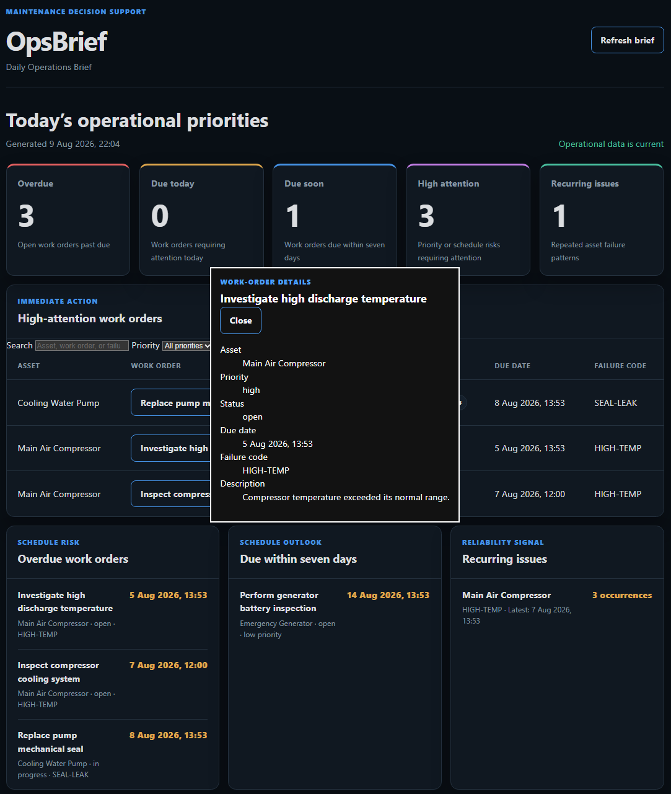

# OpsBrief Case Study

## Overview

OpsBrief is a maintenance decision-support application that transforms asset and work-order data into a focused daily operational brief.

The project was designed to demonstrate how maintenance data can be converted into actionable priorities rather than presented only as raw records.

## The Problem

Maintenance supervisors often work with information spread across CMMS records, spreadsheets, emails, messages, and shift handovers.

This fragmentation makes it harder to answer important daily questions:

- Which work orders are overdue?
- What is due today or within the next seven days?
- Which items require immediate attention?
- Which assets are experiencing recurring failures?
- What should the maintenance team prioritize first?

## Project Goals

OpsBrief was built to:

- Provide structured asset and work-order management
- Identify schedule and priority risks automatically
- Detect recurring equipment failures
- Generate a concise Daily Operations Brief
- Present operational signals through a responsive dashboard
- Protect data-changing operations with API-key authentication
- Demonstrate production-oriented development practices

## Solution

OpsBrief provides a FastAPI backend, PostgreSQL persistence, and a responsive dashboard.

The application converts work-order records into operational signals:

- Overdue work orders
- Work orders due today
- Work orders due within seven days
- High-attention work orders
- Recurring failures by asset and failure code



These signals are combined into a single Daily Operations Brief that helps a supervisor quickly identify what requires attention.

## Architecture

The project uses a layered structure:

```text
Dashboard
    ↓
FastAPI routes
    ↓
Operational signal logic
    ↓
SQLAlchemy
    ↓
PostgreSQL
```

## Testing and Quality

OpsBrief includes 38 automated tests covering:

- Health checks
- Asset creation, retrieval, updating, and deletion
- Duplicate asset-tag handling
- Work-order creation, retrieval, filtering, updating, and deletion
- Work-order status-transition rules
- Overdue, due-today, due-soon, and high-attention signals
- Recurring failure detection
- Daily Operations Brief generation
- API-key authorization
- Dashboard and static-file delivery

Tests use an isolated in-memory SQLite database, preventing test data from modifying the PostgreSQL development database.

GitHub Actions runs the complete test suite automatically whenever changes are pushed.

## Containerized Development

Docker Compose runs the FastAPI application and PostgreSQL together. Health checks confirm that both services are ready.

A new developer can start the complete stack with:

```bash
cp .env.example .env
docker compose up --build -d
```